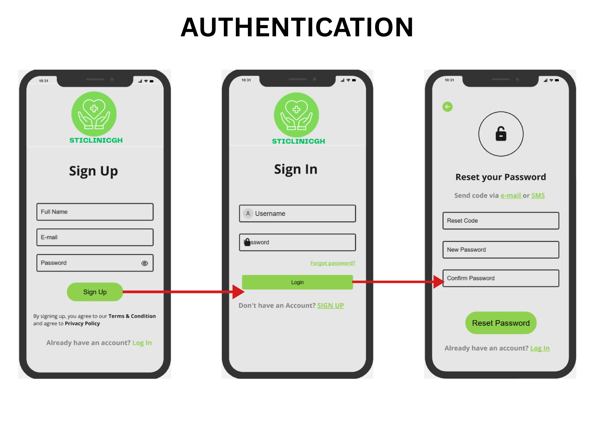
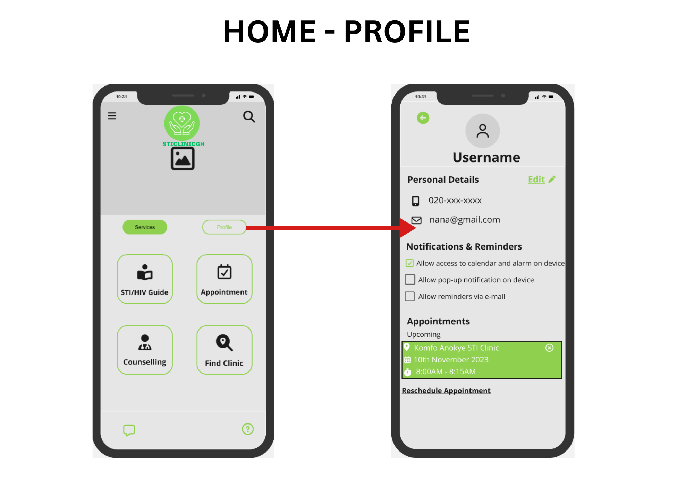
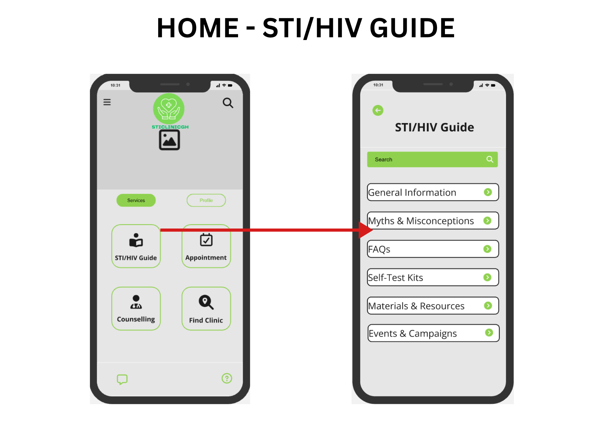
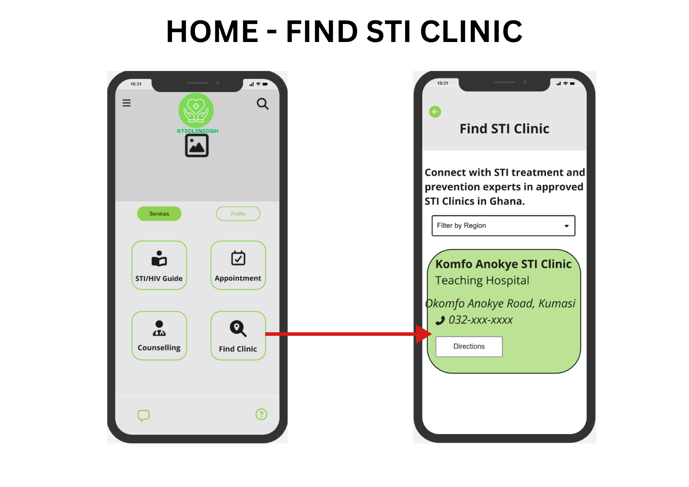
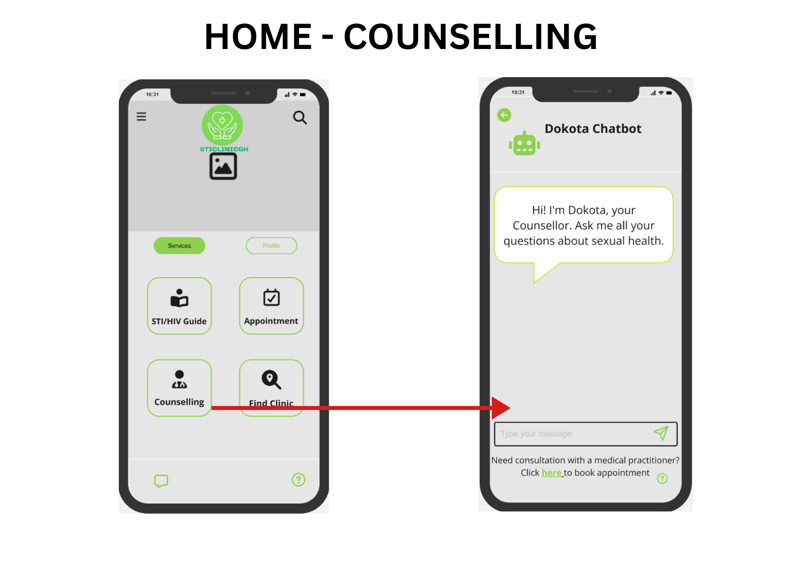

# STICLINICGh — Digital Sexual Health Solution

**Digital Health | Health Informatics | User-Centered Design**

STICLINICGh is a comprehensive mobile application designed to empower Ghanaians with accessible and confidential sexual-health information, testing, counselling, and support.

The project addresses barriers to sexual-healthcare access in Ghana, including limited access to information, stigma, difficulty locating appropriate facilities, and concerns about privacy and confidentiality.

## Key Features

- **STI/HIV Information** — access to sexual-health information and guidance
- **Clinic Directory** — find relevant STI/HIV healthcare facilities
- **Online Counselling** — access counselling and support
- **Appointment Booking** — schedule healthcare appointments
- **User Profile** — manage user information
- **Secure Access** — sign-up, login, and password-reset flows

## Prototype Screens 

**Sign Up → Login → Home → STI/HIV Information / Find STI Clinic / Counselling → Appointment → Client Information → Schedule → Confirmation**
The following screens show the main user flows developed for the STICLINICGh concept.

## 1. Sign Up, Login & Password Reset

Users can create an account, sign in, and reset their password.

---

## 2. Home & Profile

The home and profile screens provide the main entry point for accessing the application's services.

---

## 3. STI/HIV Information

Provides access to HIV/STI-related health information.

---

## 4. Find an STI Clinic

Helps users find appropriate STI healthcare services.

---

## 5. Counselling

Provides a pathway for users to access counselling services.

---

## 6. Appointment Booking

Users can provide client information, select a schedule, and confirm an appointment.

## Problem

Limited access to reliable HIV/STI information, stigma, difficulty locating comprehensive services, and concerns about privacy can discourage individuals from seeking timely sexual-health support.

STICLINICGh proposes an integrated digital solution that brings information, service discovery, counselling, and appointment access together in one user-centered platform.

## User Scenario

**Kwame**, a third-year University of Ghana student, represents a user who receives a positive HIV test result and struggles to identify confidential and comprehensive services because of stigma and limited information about available facilities.

## User Testing Insights

- **Accessibility:** Limited internet access may affect users in remote areas.
- **Security:** Users were concerned about unauthorized access and exposure of sensitive health information.
- **Communication:** Delays in test results, appointment information, and updates can create uncertainty and anxiety.

## Proposed Improvements

- Offline access to selected educational materials and FAQs
- Data minimization
- Secure communication between users and healthcare providers
- Strong security measures for sensitive information
- Healthcare-provider integration
- Continued user testing and iterative refinement
- Monitoring and evaluation

## Public Health Relevance

STICLINICGh demonstrates the application of **digital health and health informatics** to address barriers to sexual-health services, improve access to information, and support more confidential engagement with healthcare.

> **Information → Access → Confidentiality → Support → Care**

## Documentation

- [Problem Statement](documentation/problem-statement.md)
- [Solution Overview](documentation/solution.md)
- [User Persona](documentation/user-persona.md)
- [User Testing](documentation/user-testing.md)
- [Future Development](documentation/future-development.md)
- [Prototype](prototype/prototype-link.md)

## Tools & Focus

**Focus:** Digital Health, Health Informatics, Sexual Health, User-Centered Design  
**Prototype Tool:** Miro, Canva

## Author

**Kofi Sarpong, PharmD**  
Pharmacist | Data Scientist | Health Informatics & Public Health
